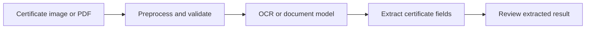

# Certificate Detector

<strong>A project space for building tools that inspect certificate documents and identify useful information.</strong>

## Project status

This GitHub repository currently contains its license and ignore rules, but no application source, model, sample data, or run instructions. It is not a runnable certificate-detection app yet.

## Suggested implementation flow

This is an intended workflow diagram, not a description of code already implemented here. Add the application, dependencies, sample inputs, privacy guidance, and reproducible run steps before presenting detection results as available.
